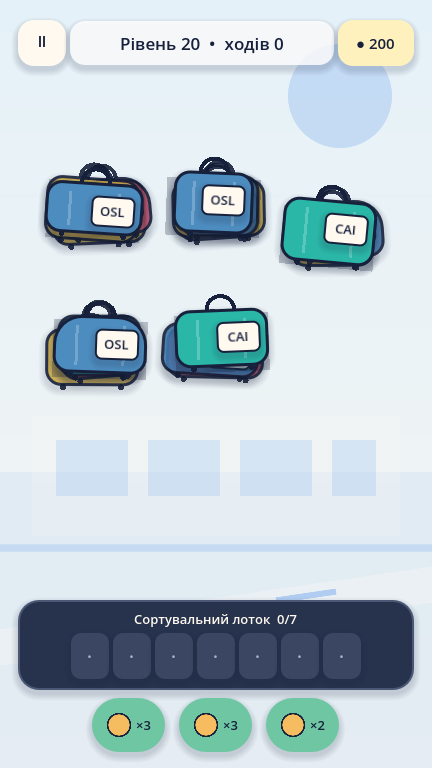

# Lost & Sorted

Offline-first hybrid-casual luggage sorting puzzle for Android, built with Godot 4.7.2. Select exposed luggage from a geometric pile, manage a seven-slot conveyor tray, dispatch destination triplets, complete airport events, and renovate five airport worlds.



## Current game

- 75 procedural campaign templates across five worlds: Regional Terminal, International Terminal, Cargo Hub, Midnight Airport, and Skyport.
- A campaign seed is created and saved on first open. Retry keeps the board; replay after a clear creates a new validated board.
- Geometric overlap creates the blocker graph. Destination triplets are shuffled as individual luggage before being distributed through 5–8 overlapping piles.
- Normal states expose 4–10 pieces from multiple destinations, producing tray-pressure decisions instead of `AAA → BBB → CCC` layers.
- Solver validation reports solution depth, inspected nodes, average branching, selectable counts, meaningful decisions, forced-move ratio, expected tray pressure, dead ends, and difficulty.
- Mystery luggage, multi-path locks/keys, move-based Priority Flights, and two-destination Transfer Baggage.
- Deterministic Daily Challenge and reproducible Airport Shift rounds with Priority Flight, Lost Tag, Belt Jam, VIP Baggage, and Heavy Load events.
- Visual airport renovation with Entrance, Check-in, Baggage Hall, Security, Cafe, Control Tower, and Runway stages plus small milestone perks.
- English and Ukrainian localization, reduced motion, text scaling, sound and haptics.
- Full campaign, saves, assets, audio, Daily, and Shift work offline. Ads remain optional and disabled without configuration.

## Architecture

```text
app/main.gd                    navigation and gameplay transaction orchestration
app/screens/                   Home, Campaign, Gameplay, Airport, Shift, Settings, Result
app/components/                persistent luggage, tray, booster, currency, level, objective views
core/gameplay/game_state.gd    authoritative serializable sorting rules
core/generation/               seeded board construction and quality rejection
core/solver/                   UI-independent search and decision metrics
services/save_service.gd       schema-v2 migration, seeds, progression, renovation, Shift
data/configs/campaign.json     world/stage counts and difficulty templates
data/campaign/                 75 representative validated boards and reports
data/localization/             complete EN/UK player-facing copy
assets/                        original reproducible SVG and WAV assets
tools/level_baker/             campaign baker, profiler, 10,000-board stress tool
tests/run_all.gd               headless unit and integration suite
```

`SortingGameState` owns every gameplay rule. `LevelGenerator` and `LevelSolver` never touch the scene tree. `GameplayScreen` creates one `LuggageView` per board item and updates those nodes in place; a tap no longer rebuilds the complete screen.

See [architecture](docs/ARCHITECTURE.md), [game design](docs/GAME_DESIGN.md), and [QA checklist](docs/QA_CHECKLIST.md).

## Run

Install Godot 4.7.2 stable, then from this directory:

```powershell
godot --path . --editor
godot --path .
```

The reference viewport is 432×768 portrait with Compatibility rendering.

## Test and validate

```powershell
godot --headless --path . --editor --quit
godot --headless --path . --script res://tests/run_all.gd
godot --headless --path . --script res://tools/level_baker/bake_campaign.gd
godot --headless --path . --script res://tools/level_baker/stress_generation.gd -- 10000
godot --headless --path . --quit-after 120
```

Expected outputs:

- tests print `TESTS: ... passed, 0 failed`;
- baker prints `CAMPAIGN: 75/75 passed` and rewrites `data/campaign/index.json`, `level_001.json`–`level_075.json`, and `validation_report.txt`;
- stress prints `STRESS: 10000 candidates, 0 failures, 0 impossible` and writes `data/campaign/stress_report.json`.

Latest recorded validation: 75/75 representative campaign boards passed; 10,000 stress boards produced 0 generation failures and 0 impossible boards, average 1.02 generation attempts, average 6.50 initial selectable items, average branching 5.17, forced-move ratio 0.05, and solver p50/p95/p99 of 34/81/144 ms on the validation host.

Regenerate original art and audio:

```powershell
godot --headless --path . --script res://tools/asset_generation/generate_assets.gd
```

Capture the five repository screenshots:

```powershell
godot --path . -- --capture-screens
```

## Procedural generation

1. Resolve a campaign template and persisted seed.
2. Choose destination groups, then create every individual luggage item.
3. Seed-shuffle destinations and item-to-stack allocation.
4. Place items into 5–8 2D pile regions with rotation, scale, and depth.
5. Derive blockers only from rectangle overlap and z order.
6. Add world mechanics and deterministic Shift events.
7. Solve the board and calculate decision-quality metrics.
8. Reject unsolved, low-choice, overly forced, or low-pressure boards and retry with a deterministic derived seed.

Runtime search is capped so a pathological seed is regenerated instead of stalling mobile hardware. The original saved seed still reproduces the same accepted candidate and generation attempt.

## Saves and randomness

Save schema 2 migrates old 150-level debug profiles into the 75-stage structure, remaps old airport fields, carries Endless high score into Airport Shift, and clears obsolete generated seeds safely.

- Campaign: persisted per-level seed until clear.
- Retry: current definition and seed are reused.
- Replay after clear: cleared seed is removed and a new one may be generated.
- Daily: deterministic date plus content salt.
- Shift: deterministic run seed plus round number; events and boards reproduce for debugging.

The profile is stored at `user://lost_sorted_save.json`, with atomic temp-write and backup rotation.

## Android debug APK

Requirements: Godot 4.7.2 export templates, OpenJDK 17, Android SDK platform/API 36, Build Tools 36.0.0, and the Godot Gradle build template.

```powershell
$env:GODOT_PATH = 'C:\path\to\Godot_v4.7.2-stable_win64_console.exe'
.\scripts\build_debug.ps1
```

Output: `build/lost-and-sorted-debug.apk`. The preset uses minimum SDK 24 and target SDK 36.

## Release AAB

Set these outside Git:

```text
GODOT_ANDROID_KEYSTORE_RELEASE_PATH
GODOT_ANDROID_KEYSTORE_RELEASE_USER
GODOT_ANDROID_KEYSTORE_RELEASE_PASSWORD
```

Then run `scripts/build_release.ps1` or `scripts/build_release.sh`. Output is `build/lost-and-sorted-release.aab`. The script refuses to claim release success without a signed artifact.

## Optional ads

Core gameplay never requires ads. The desktop build uses a controllable mock; the Android adapter remains inactive until a publisher installs the pinned plugin, configures consent, and supplies production IDs outside version control.

## License and notices

Project-specific source and original generated assets are provided with this repository. Godot is MIT licensed. See [THIRD_PARTY_NOTICES.md](THIRD_PARTY_NOTICES.md).
