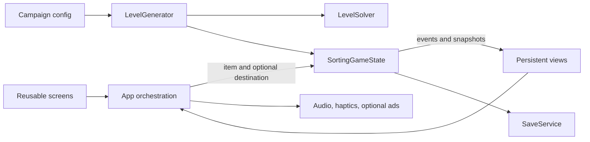

# Architecture

## Boundaries

`SortingGameState` is authoritative. UI code never decides blockers, matches, locks, transfer choices, deadlines, or terminal state. Generator and solver are `RefCounted` and scene-tree independent.

## Presentation

`app/main.gd` owns navigation and transactions. Screens are separate Controls under `app/screens/`. Reusable visuals live in `app/components/`.

`GameplayScreen` creates luggage nodes once for a level. After a move it updates visibility, interaction, depth and tray content in place. The selected node lifts and travels to the exact tray slot before the domain mutation. Reduced motion skips travel while keeping state order unchanged.

## Domain transaction

1. Accept only a selectable item during `PLAYING`.
2. Require one of the advertised choices for Transfer Baggage.
3. Record a deep pre-action snapshot.
4. Remove the item; keys unlock without entering the tray.
5. Insert the chosen destination, decrement move events, then resolve all triplets.
6. Update Priority/VIP state, Mystery visibility, win, and loss.
7. Emit a presentation event with item, destination, matches, and terminal state.

Undo restores item data, tray order, locks, deadlines, jam moves, score and move count. Booster-use accounting remains outside the restored move state.

## Geometric generation

Destination groups and physical depth are independent. The generator creates individual luggage, seed-shuffles destinations and stack assignment, places them at normalized 2D anchors with jitter/rotation/scale, and computes blocker IDs from rectangle overlap plus z order.

A constructive group order guarantees that a valid route can exist, but the top of different stacks exposes future destinations as meaningful alternatives. Locks, Mystery, Priority, Transfer, and Shift events are applied before an independent solver pass.

The runtime solver has a bounded node budget. Rejected candidates derive their next layout seed deterministically from the saved base seed.

## Solver and quality metrics

The solver uses domain snapshots, canonical memoization, transfer-choice actions, and heuristics for exposed triplets, tray pairs, keys, Priority goals, and newly exposed luggage. It reports:

- solved and reason;
- solution depth;
- expanded search states and inspected candidate nodes;
- average branching factor;
- initial and average selectable count;
- meaningful decision count;
- forced-move ratio;
- expected peak tray pressure;
- dead ends;
- solve time and normalized difficulty score.

Quality acceptance rejects unsolved boards, too few opening choices, low branching, excessive forced moves, low meaningful-decision coverage, and trivial pressure.

## Data-driven campaign

`data/configs/campaign.json` owns world and stage counts. No UI or save rule assumes 150 stages. The baker writes 75 representative artifacts for CI and review, while runtime campaign boards use persisted first-open seeds.

Daily hashes date plus salt. Airport Shift hashes run seed plus round and then chooses a seeded event. All modes pass through the same validation pipeline.

## Persistence

Save schema 2 adds campaign seeds, campaign content version, Airport Shift state, airport perks, and the new progression shape. Migration maps old 150-stage completion into 75 stages, renames old renovation zones, imports Endless high score, and clears stale generated content. Writes use temp file, flush, backup rotation, and atomic rename.

## Android

The project uses Compatibility rendering, portrait orientation, minimum SDK 24, target SDK 36, Gradle APK/AAB exports, and ETC2/ASTC texture imports. Signing inputs remain outside Git. Core gameplay has no network dependency.
