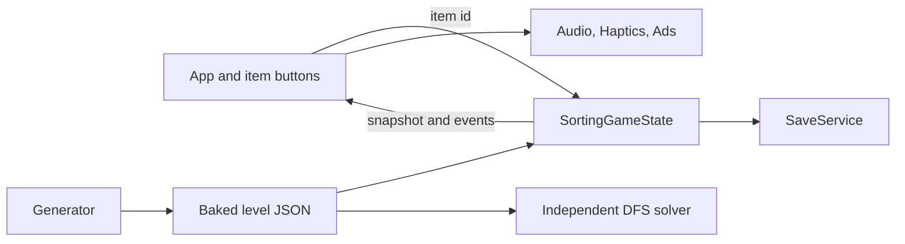
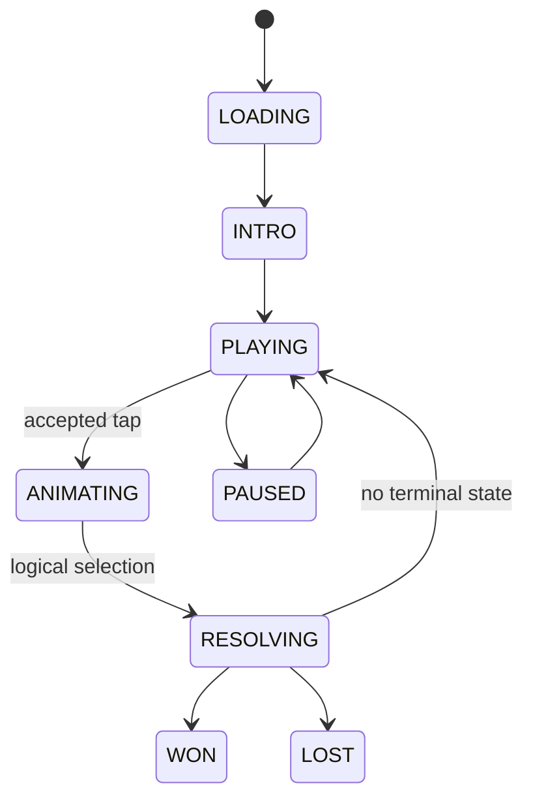

# Architecture

## Boundaries

The project is intentionally small in runtime surface but strict about ownership. `SortingGameState` is the authoritative serializable domain. UI nodes are disposable projections. `LevelGenerator` creates reproducible data. `LevelSolver` creates new domain states from snapshots and never touches a scene tree.

## Gameplay transaction

Only `PLAYING` accepts item input. Before a selection, the domain records a bounded snapshot. The item is marked removed exactly once, keys unlock their group without occupying the tray, normal luggage enters the tray, deterministic batches of three resolve, priority state advances, then win/loss is evaluated. Loss is therefore impossible before pending matches finish.

## Board and tray

Items carry stable IDs, destination IDs, normalized position, z index, explicit blocker IDs and optional special data. Accessibility is graph-based, never inferred from physics overlap. The tray is an ordered array of destination IDs and presentation grouping cannot change its rules.

Undo restores data snapshots without Node references. Shuffle cyclically remaps complete remaining destination groups while keeping counts and priority items fixed, preserving the baked solution structure. Extra Slot changes capacity once for the current state.

## Generation and solver

Campaign parameters choose a fixed seed, world, one of 15 layout families and mechanic counts. Generation lays down complete triplets in a known top-to-bottom removal order; each later group declares the previous triplet as blockers. Keys are accessible before their lock group. Priority destinations occupy the first reachable triplet with a six-move deadline.

The solver performs deterministic depth-first search with canonical state memoization, a 200,000-node cap and heuristics for keys, priority items, tray pairs and newly exposed items. Baking performs structural validation first, then solves every level without boosters. Runtime loads baked JSON and does not run campaign generation or validation.

## Persistence

`SaveService` merges only known fields into defaults, retains unknown future fields on disk without using them, exposes a migration seam, writes a temporary file, flushes, rotates the primary to a backup, then atomically renames the temporary file. Missing, partial and malformed profiles fall back safely.

## Services

- Audio: four lightweight players, local WAV only, setting-aware.
- Haptics: Android-only no-op elsewhere.
- Ads: mock modes for desktop QA; optional pinned Android adapter; failures never block gameplay.
- Local analytics: debug-only JSONL events in `user://`; no identifiers or external endpoint.
- Localization: Godot translation CSV with complete EN/UK user-facing keys.

## Navigation and lifecycle

The root scene owns screen construction, Back routing and overlays. Gameplay focus loss pauses the move-based session, so background time cannot consume priority moves. Each screen is rebuilt from current state, making language and text scale changes immediate.

## Android layer

The project uses Compatibility rendering, portrait orientation, Gradle export, min SDK 24 and target SDK 36. APK and AAB are separate presets. Signing lives only in environment/editor configuration. Optional AdMob v7.0 is intentionally not vendored so desktop and CI remain deterministic and license upgrades are explicit.

